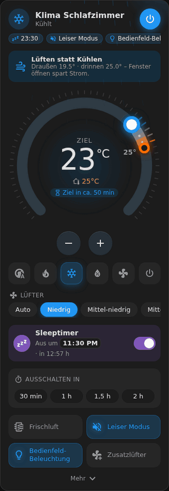
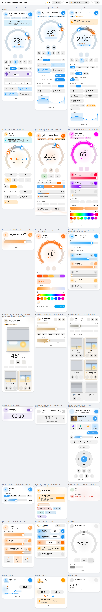
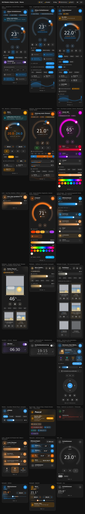

# HA Modern Home Cards

Moderne Lovelace-Karten für Home Assistant im gemeinsamen Design – Ring-Regler, Glow,
weiche Farbübergänge und Animationen. Ein HACS-Download, mehrere Karten:

| Karte | Typ | Für |
| --- | --- | --- |
| **Modern Climate Card** | `custom:ha-climate-card` | Klimaanlagen und Heizungen/Thermostate |
| **Modern Light Card** | `custom:ha-light-card` | Lampen und Lichtgruppen (z.B. Hue-Räume) |
| **Modern Light Group** | `custom:ha-light-group-card` | frei zusammengestellte Lampen: Gruppe oben, Einzellampen darunter |
| **Modern Cover Card** | `custom:ha-cover-card` | Rollläden, Jalousien, Markisen – einzeln oder als HA-Gruppe |
| **Modern Cover Group** | `custom:ha-cover-group-card` | frei zusammengestellte Rollläden: alle oben, einzelne darunter |
| **Modern Switch & Time** | `custom:ha-switch-time-card` | Schalter + Uhrzeit (input_datetime): Wecker, Zeitschaltung, Sleeptimer |
| **Modern Media Card** | `custom:ha-media-card` | Harmony Hub (Aktivitäten, Fernbedienung) und Media-Player |
| **Modern Room Header** | `custom:ha-room-card` | Raum-Kopf mit Status-Chips und Hinweis „Fenster offen – Klima läuft“ |
| **Modern Status Card** | `custom:ha-status-card` | Batterien (automatisch je Bereich) und Tür-/Fensterkontakte |
| **Modern Vacuum Card** | `custom:ha-vacuum-card` | Saugroboter mit Karte, Raumauswahl und Raumreinigung |
| **Modern Presence Card** | `custom:ha-presence-card` | Personen mit Foto und Handy-Akku plus Haustür (Nuki Opener: Halten zum Öffnen, Ring to Open) |
| **Modern Alert Card** | `custom:ha-alert-card` | Hinweise, die nur erscheinen, wenn etwas los ist („Fenster offen – Marcel“) |
| **Modern Energy Card** | `custom:ha-energy-card` | Energiefluss Solar / Batterie / Netz / Haus + einzelne Verbraucher (Konfiguration wie power-flow-card-plus) |
| **Modern Irrigation Card** | `custom:ha-irrigation-card` | Hauswasserwerk / Pumpe mit parallelen Ventilen am Verteiler, Strang „Sonstiges“, Restzeit, Durchfluss |
| **Modern Pool Card** | `custom:ha-pool-card` | Pool: animiertes Becken mit Filterpumpe, Temperatur / pH / Redox mit Bereich und 48-h-Verlauf, Filterlaufzeit, Modus, Pflege, Rückspülen |
| **Modern Camera Card** | `custom:ha-camera-card` | Eine Kamera (Reolink, Blink …): Live-/Standbild, Erkennung, Licht, Sirene, Schwenken, Positionen, Linsen – automatisch über das Gerät erkannt |
| **Modern Camera Group** | `custom:ha-camera-group-card` | Mehrere Kameras als Raster mit Bewegung, Akku, WLAN, Scharf/Unscharf und Erkennung je Kamera |
| **Modern Select Card** | `custom:ha-select-card` | Dropdowns (input_select/select) als Leiste, Chips, Kacheln, Liste oder kompaktes Dropdown – mit Symbolen und Farben je Option |
| **Modern Recipe Card** | `custom:ha-recipe-card` | Mealie: Essensplan der Woche, Rezeptsuche, Rezept mit Portionen, Einkaufsliste |
| **Modern Scene Card** | `custom:ha-scene-card` | Szenen nach Raum mit Farbe/Symbol, zuletzt aktiv, Lampen und „Alles aus“ |
| **Modern Sleep Card** | `custom:ha-sleep-card` | Schlafmodus, Sleep-Timer mit Countdown, Klima, Wecker, „Gute Nacht“ |
| **Modern Climate Rooms Card** | `custom:ha-climate-rooms-card` | Klima-Übersicht 2.0: alle Räume mit Heizung, Klimaanlage, Fenster, Feuchte |
| **Modern Parcel Card** | `custom:ha-parcel-card` | Pakete & Post über 17TRACK: Status, Versender, Filter, + Paket, Archivieren |
| **Modern Router Card** | `custom:ha-router-card` | Router (FRITZ!Box, TP-Link …): Durchsatz, Leitung, CPU/RAM, WLAN, Geräte im Netz, Neustart |
| **Modern Lock Card** | `custom:ha-lock-card` | Türschloss / Nuki Opener: Auf/Ab, Öffnen mit Rückfrage, Ring to Open, Klingel, Akku, Verlauf mit Person |
| **Modern Temperature Card** | `custom:ha-temperature-card` | Temperatur-Überwachung: Kacheln mit Trend, Min/Max, Grenzwert-Warnung, gemeinsamer Verlauf |
| **Modern Plug Card** | `custom:ha-plug-card` | Steckdosen: An/Aus mit Rückfrage, Leistung, Verbrauch und Kosten heute/Monat, Verlauf, Überlast und „läuft nicht“ |
| **Modern Grill Card** | `custom:ha-grill-card` | Grillthermometer (Meater): Kern gegen Ziel als Ring, Garraum, Restzeit, Kochstatus, Verlauf |
| **Modern Network Card** | `custom:ha-network-card` | Funknetz (Zigbee2MQTT, ZHA, Shelly): Signal, Akku, zuletzt gesehen, Warnungen, Updates, Neustart |
| **Modern Energy Week Card** | `custom:ha-energy-week-card` | Wochenrückblick Energie: diese gegen letzte Woche, Kosten, Verbraucher |
| **Climate Overview** | `custom:ha-climate-overview-card` | alle Klimageräte auf einen Blick |

*Modern Lovelace cards for Home Assistant in one shared design – English summary below.*

<p align="center"></p>

| Hell | Dunkel |
| --- | --- |
|  |  |

## Modern Climate Card – Funktionen

- **Zwei Layouts:** `full` (runder Drehregler, ziehbar) und `compact` (Kachel mit +/- und ausklappbaren Details)
- **Alle Klima-Funktionen** – werden automatisch anhand von `supported_features` ein-/ausgeblendet:
  - Betriebsmodi (Auto, Heizen/Kühlen, Heizen, Kühlen, Entfeuchten, Nur Lüfter, Aus) und Ein/Aus-Taste
  - Zieltemperatur einzeln **oder als Bereich** (`target_temp_low`/`target_temp_high`, zwei Regler)
  - Lüfterstufen, Lamellen vertikal **und horizontal**, Voreinstellungen (Eco, Boost, Sleep …)
  - Ziel-Luftfeuchte
  - Aktuelle Aktion (heizt/kühlt/Leerlauf) mit Farbe und Animation
- **Ausklappbar:** Auch im vollen Layout bleiben Regler, Modi, Lüfter und Schalter sichtbar; Lamellen, Voreinstellungen, Luftfeuchte, Sensoren und Verlauf liegen unter „Mehr“
- **Dropdown bei vielen Optionen:** z.B. die 12 Lamellen-Stellungen von Gree-Geräten (Schwelle einstellbar)
- **Schalter-Buttons:** Schalter und Buttons desselben Geräts werden automatisch übernommen (z.B. Gree: Frischluft, Leiser Modus, Bedienfeld-Beleuchtung, X-Fan) – oder eigene Schalter, Skripte und Szenen festlegen
- **Ist-Wert im Regler:** Ein Bogen mit Farbverlauf zeigt den Abstand zwischen Ist- und Zieltemperatur (warm → kühl beim Kühlen, kalt → warm beim Heizen), animiert solange die Anlage arbeitet
- **Externe Ist-Temperatur:** Raumsensor *oder* Thermostat (z.B. Homematic-Wandthermostat) eintragen – ohne Eintrag wird automatisch die Temperatur der Klimaanlage genutzt
- **Sleeptimer:** Klassisches Helfer-Muster (Schalter zum Scharfschalten + Uhrzeit) direkt in der Karte, inkl. Restzeit – passender Blueprint liegt bei
- **Tätigkeit auch ohne `hvac_action`:** Geräte wie Gree melden nicht, ob sie gerade kühlen – die Karte leitet es aus Ist-/Solltemperatur (optional Leistung) ab, inkl. Animationen und Laufzeit
- **Ziel-Prognose:** „Ziel in ca. 25 min“, geschätzt aus dem Temperaturverlauf; **Laufzeit heute** als Kachel
- **Status-Chips** im Kopf: Voreinstellung, aktive Schalter, Sleeptimer, Schnell-Timer
- **Deutsche Bezeichnungen** für Lüfter-, Lamellen- und Preset-Werte (z.B. Gree „Oben fest“, „Mittel-niedrig“)
- **Rückmeldung & Komfort:** Sync-Anzeige, Fehlermeldung bei fehlgeschlagenen Befehlen, Haptik in der HA-App, +/− gedrückt halten
- **Für Wandtablets:** `animations: reduced` oder `off`; Verlauf lädt erst beim Aufklappen
- **Smarte Hinweise:** „Lüften statt Kühlen/Heizen“, wenn es draußen deutlich kühler/wärmer ist, sowie Schimmelwarnung bei hoher Luftfeuchte (mit Taupunkt und Ein-Tipp-„Entfeuchten“)
- **Wetter heute:** Höchst-/Tiefsttemperatur, Regenwahrscheinlichkeit und Wettersymbol aus einer `weather`-Entität
- **Schnell-Timer:** „Ausschalten in 30 / 60 / 90 / 120 min“ mit Countdown (Timer-Helfer + Blueprint)
- **Luftstrom-Animation:** dezente Animation, Tempo nach Lüfterstufe, Pendeln nach Lamellenstellung
- **Übersichtskarte:** alle Klimaanlagen auf einen Blick mit Regler, Ein/Aus und „Alle aus“ (`custom:ha-climate-overview-card`)
- **Zusatzsensoren:** Raumtemperatur, Raumluftfeuchte, Außentemperatur, Leistung, Energie, Fenster-/Türkontakt
- **Fenster-Warnung**, wenn der Kontakt offen ist
- **Verlaufsgraph** (Ist- und Zieltemperatur, Heiz-/Kühlphasen als Farbbänder)
- **Visueller Editor** im Dashboard – kein YAML nötig
- **Deutsch & Englisch** (folgt der HA-Spracheinstellung; Modi werden über die HA-eigenen Übersetzungen der Integration angezeigt)
- Passt sich dem HA-Theme an (hell/dunkel), Tastaturbedienung am Regler

- **Heizungen & Thermostate:** automatisch erkanntes Heizungs-Profil (z.B. Homematic IP) mit Wochenprogramm-Leiste, „Nächster Wechsel“, Boost-Button, Ventilöffnung je Heizkörper, Batterie-Warnung, Abwesend-Modus und Wärmewellen-Animation

## Installation

### HACS (empfohlen)

1. HACS öffnen → oben rechts **⋮ → Benutzerdefinierte Repositories**
2. URL `https://github.com/passi277/HA-Modern-Home-Cards` mit Typ **Dashboard** hinzufügen
3. „HA Modern Home Cards“ suchen, installieren und den Browser neu laden

### Manuell

1. `dist/ha-modern-home-cards.js` nach `<config>/www/` kopieren
2. Unter **Einstellungen → Dashboards → ⋮ → Ressourcen** hinzufügen:
   URL `/local/ha-modern-home-cards.js`, Typ **JavaScript-Modul**

### Umstieg von „HA Climate Card“

Das Projekt hieß früher *HA Climate Card*. Alle Kartentypen bleiben gleich, deine Karten laufen weiter.
`dist/ha-climate-card.js` wird übergangsweise weiter mitgeliefert. Nach der Umbenennung des Repos:
in HACS das alte benutzerdefinierte Repository entfernen, das neue hinzufügen, installieren und die alte
Ressource `/hacsfiles/HA_Climate_Card/ha-climate-card.js` unter *Dashboards → Ressourcen* löschen.

## Konfiguration

Am einfachsten über **Karte hinzufügen → HA Climate Card** im visuellen Editor. YAML-Beispiel:

```yaml
type: custom:ha-climate-card
entity: climate.wohnzimmer
name: Wohnzimmer
layout: full            # full | compact
show:
  modes: true
  fan: true
  swing: true
  presets: true
  humidity: true
  sensors: true
  graph: true
  shortcuts: true
expandable: true        # Details im vollen Layout ausklappbar
start_expanded: false
dropdown_threshold: 6   # ab 7 Optionen Dropdown statt Chips
auto_shortcuts: true    # Schalter des Geräts automatisch anzeigen
# shortcuts:            # optional: eigene Liste (ersetzt die automatische)
#   - switch.klima_frische_luft
#   - entity: script.klima_turbo_10_min
#     name: Turbo
#     icon: mdi:rocket-launch
temperature_sensor: climate.wandthermostat_wohnzimmer   # Sensor oder Thermostat; leer = Klimaanlage
use_sensor_for_current: true
timer_switch: input_boolean.sleeptimer_wohnzimmer
timer_time: input_datetime.sleeptimer_wohnzimmer
countdown_timer: timer.klima_wohnzimmer
countdown_durations: [30, 60, 90, 120]
weather_entity: weather.zuhause
ventilation_delta: 3     # Lüften-Hinweis ab 3° Unterschied innen/außen
humidity_warning: 70     # Schimmelwarnung ab 70 % Luftfeuchte (0 = aus)
humidity_sensor: sensor.wohnzimmer_luftfeuchte
outdoor_sensor: sensor.aussentemperatur
power_sensor: sensor.klima_leistung
energy_sensor: sensor.klima_energie
contact_sensors:          # beliebig viele Fenster und Türen
  - binary_sensor.wohnzimmer_fenster
  - entity: binary_sensor.balkon
    name: Balkontür
    type: door              # optional, sonst aus device_class bzw. Name erkannt
graph_hours: 24
```

| Option | Typ | Standard | Beschreibung |
| --- | --- | --- | --- |
| `entity` | string | **erforderlich** | `climate.*`-Entität |
| `name` | string | Anzeigename | Eigener Titel |
| `icon` | string | automatisch | Eigenes Symbol im Kopf |
| `layout` | `full` \| `compact` | `full` | Drehregler oder kompakte Kachel |
| `show.modes` | bool | `true` | Betriebsmodi-Leiste |
| `show.fan` | bool | `true` | Lüfterstufen |
| `show.swing` | bool | `true` | Lamellen (vertikal + horizontal) |
| `show.presets` | bool | `true` | Voreinstellungen |
| `show.humidity` | bool | `true` | Ziel-Luftfeuchte |
| `show.sensors` | bool | `true` | Sensor-Kacheln |
| `show.graph` | bool | `false` | Verlaufsgraph |
| `show.shortcuts` | bool | `true` | Schalter-Buttons |
| `expandable` | bool | `true` | Volles Layout: Details (Lamellen, Voreinstellungen, Luftfeuchte, Sensoren, Verlauf) unter „Mehr“ einklappen |
| `start_expanded` | bool | `false` | Details anfangs ausgeklappt |
| `dropdown_threshold` | number | `6` | Mehr Optionen als dieser Wert → Dropdown statt Chips (`0` = immer Chips) |
| `auto_shortcuts` | bool | `true` | Schalter/Buttons desselben Geräts automatisch als Buttons anzeigen |
| `shortcuts` | list | – | Eigene Buttons: Entity-IDs oder `{entity, name, icon}`; Schalter werden umgeschaltet, Skripte/Szenen gestartet, Buttons gedrückt. Rechtsklick/langes Drücken öffnet die Details |
| `temperature_sensor` | entity | – | Externe Ist-Temperatur: `sensor.*` oder Thermostat `climate.*` (dessen `current_temperature`/`current_humidity`). Leer = Werte der Klimaanlage |
| `use_sensor_for_current` | bool | `true` | Externen Wert als Ist-Temperatur nutzen (Regler, Kopf, Graph). `false` = nur als Sensor-Kachel |
| `show.timer` | bool | `true` | Sleeptimer- und Schnell-Timer-Zeile |
| `show.hints` | bool | `true` | Hinweise (Lüften, Schimmel) und Taupunkt-Kachel |
| `show.airflow` | bool | `true` | Luftstrom-Animation, solange das Gerät läuft |
| `device_type` | `auto` \| `ac` \| `heating` | `auto` | Darstellung als Klimaanlage oder Heizung; `auto` erkennt Thermostate (keine Lüfter/Lamellen, nur Heizen/Auto/Aus) |
| `valve_sensors` | list | automatisch | Ventilöffnung (%) der Heizkörper; ohne Angabe aus Gerät/Bereich übernommen |
| `battery_sensors` | list | automatisch | Batteriestand (%) der Thermostate; Warnung unter 20 % |
| `auto_heating_sensors` | bool | `true` | Ventil-/Batteriesensoren automatisch aus Gerät bzw. Bereich übernehmen |
| `away_temperature` | number | `17` | Temperatur für „Abwesend“ (Homematic `enable_away_mode_by_duration`) |
| `animations` | `full` \| `reduced` \| `off` | `full` | `reduced`: keine Daueranimationen (für ältere Wandtablets), `off`: zusätzlich keine Übergänge |
| `power_threshold` | number | `25` | Unter dieser Leistung (W, aus `power_sensor`) gilt das Gerät als im Leerlauf – für Geräte ohne `hvac_action` |
| `countdown_timer` | entity | – | Timer-Helfer (`timer.*`) für „Ausschalten in …“ |
| `countdown_durations` | list | `[30, 60, 90, 120]` | Schnell-Timer-Dauern in Minuten |
| `weather_entity` | entity | – | Wetter-Entität für die Vorhersage heute; dient auch als Außentemperatur, wenn kein `outdoor_sensor` gesetzt ist |
| `ventilation_delta` | number | `3` | Temperaturdifferenz innen/außen, ab der „Lüften statt Kühlen/Heizen“ erscheint |
| `humidity_warning` | number | `70` | Luftfeuchte (%), ab der die Schimmelwarnung erscheint (`0` = aus) |
| `timer_switch` | entity | – | Schalter zum Scharfschalten des Sleeptimers (`input_boolean`/`switch`) |
| `timer_time` | entity | – | Ausschaltzeit (`input_datetime`, nur Uhrzeit oder Datum + Uhrzeit) |
| `humidity_sensor` | entity | – | Externer Luftfeuchte-Sensor |
| `outdoor_sensor` | entity | – | Außentemperatur (`sensor.*` oder `weather.*`) |
| `power_sensor` | entity | – | Aktuelle Leistung (W) |
| `energy_sensor` | entity | – | Energieverbrauch (kWh) |
| `contact_sensors` | list | – | Beliebig viele Fenster-/Türkontakte (`binary_sensor`): Entity-IDs oder `{entity, name, type: window\|door}`. Offene werden im Kopf, als Hinweis und als Chip angezeigt |
| `window_sensor` | entity | – | Veraltet (ein einzelner Kontakt) – funktioniert weiter und wird im Editor automatisch in `contact_sensors` übernommen |
| `graph_hours` | number | `24` | Zeitraum des Verlaufsgraphen in Stunden |

## Modern Light Card

Licht im gleichen Design: Ring = Helligkeit, Glow und Ring leuchten in der echten Lichtfarbe.

- **Helligkeitsring** (nur am Ring bedienbar) mit −/+ (gedrückt halten), Kompakt-Variante als Farbverlauf-Regler
- **Lampen des Raums**: bei Lichtgruppen (z.B. Hue-Räume) automatisch, jede mit eigener Farbe, antippen schaltet, lange drücken öffnet Details
- **Szenen**: Hue-Szenen der Gruppe automatisch (doppelte zusammengefasst) oder eigene Liste
- **Weißton** (Kelvin-Regler) und **Farbe** (Farbton-Regler + Farbfelder), **Szenen/Effekte** (z.B. Hue Play Gradient, Govee) – lange Listen mit Suchfeld
- **LED-Segmente** als farbige Leiste und **Geräteschalter** (z.B. Govee „Gradient“), automatisch erkannt
- **Bewegungsmelder** („Bewegung vor 4 min“) und **Helligkeitssensor** (lx) im Kopf
- Visueller Editor, Deutsch/Englisch, `animations`-Option

```yaml
type: custom:ha-light-card
entity: light.gaste_wc                  # Lampe oder Gruppe
motion_sensor: binary_sensor.bewegung_gaste_wc
illuminance_sensor: sensor.helligkeit_gaste_wc
layout: full                            # full | compact
# entities: [light.a, light.b]          # eigene Lampenliste statt Gruppe
# scenes: [scene.lesen, scene.hell]     # eigene Szenen statt Hue-Szenen
```

| Option | Standard | Beschreibung |
| --- | --- | --- |
| `entity` | – | `light.*` (Lampe oder Gruppe) |
| `layout` | `full` | `full` (Ring) oder `compact` (Regler) |
| `entities` / `auto_entities` | aus Gruppe / `true` | Lampen des Raums |
| `lights_layout` | `rows` | `rows` = jede Lampe einzeln steuerbar (Regler, ⚙ Weißton/Farbe), `tiles` = kompakte Ein/Aus-Kacheln |
| `scenes` / `auto_scenes` | Hue-Szenen / `true` | Szenen-Chips |
| `segments` / `auto_segments` | `light.<name>_segment_NNN` / `true` | Segmente eines LED-Streifens |
| `shortcuts` / `auto_shortcuts` | Schalter/Buttons des Geräts / `true` | Geräteschalter (ohne technische Power-/Request-Entitäten) |
| `motion_sensor`, `illuminance_sensor` | – | Anzeige im Kopf |
| `show.lights/scenes/color/temperature/effects/segments/shortcuts` | `true` | Bereiche ein-/ausblenden |
| `expandable`, `start_expanded`, `animations` | `true`, `false`, `full` | wie bei der Klima-Karte |

### Govee (govee2mqtt)

Govee-Lampen und -Streifen funktionieren direkt: An/Aus, Helligkeit, Farbe, Weißton und die Govee-Szenen.

- **Szenen**: Die ~300 Govee-Szenen erscheinen als Liste mit **Suche** („fire“ → alle Fire-Varianten). „Kein Effekt“ beendet eine Szene, indem die aktuelle Farbe bzw. der Weißton erneut gesetzt wird.
- **Segmente**: `light.carport_segment_001…` werden zur Haupt-Lampe `light.carport` (auch `light.carport_2`) automatisch erkannt und als Leiste in ihrer Farbe gezeigt; Tippen öffnet die Details des Segments.
- **Schalter** wie `switch.carport_gradient_toggle` erscheinen als Button; Power-Switch und „Request … State“-Buttons werden ausgeblendet.
- Segmente und Schalter gibt es nur in der Home-Assistant-Instanz, in der govee2mqtt läuft. Wird die Lampe in ein anderes HA gespiegelt (z.B. per Remote Home-Assistant), dort die Karten ebenfalls über HACS installieren – oder die Segmente per `segments:` angeben, falls sie mitgespiegelt werden.

```yaml
type: custom:ha-light-card
entity: light.carport_2
# segments: [light.carport_segment_001, light.carport_segment_002]
# shortcuts: [switch.carport_gradient_toggle]
```

**Musik-Modi:** Hat die Lampe Musik-Effekte (bei govee2mqtt „Music: Energic“, „Music: Rhythm“ …), zeigt die Karte einen eigenen Bereich **Musik**
mit einem Chip je Modus (deutsche Namen, eigene Symbole), einem „Aus“-Chip und einem kleinen Equalizer, solange ein Musikmodus läuft. Die Modi stehen
dann nicht mehr doppelt in der Effektliste. Abschaltbar im Editor unter „Sichtbare Bereiche“ bzw. mit `show: { music: false }`.

## Modern Light Group

Beliebige Lampen zu einer Karte zusammenstellen – auch ohne Lichtgruppe in Home Assistant und gemischt
(Hue, Govee, Zigbee, Ein/Aus-Steckdosen …).

- **Oben die Gruppe**: Status („3 von 5 an · 79 %“), alle ein/aus, leuchtender Helligkeitsregler für alle
  dimmbaren Lampen, „Farbe für alle“ (Weißtöne nur an Lampen mit Weißton, Farben nur an Farblampen)
- **Darunter jede Lampe** im Kompakt-Stil – automatisch nur mit dem, was sie kann:
  Helligkeitsregler nur bei dimmbaren Lampen, über ⚙ Weißton / Farbe / Effekte nur wenn unterstützt,
  reine Ein/Aus-Lampen nur mit Schalter, nicht verfügbare Lampen ausgegraut
- Tippen auf den Namen öffnet die Details der Lampe; Einzellampen lassen sich zuklappen

```yaml
type: custom:ha-light-group-card
title: Wohnzimmer
entities:
  - light.stehlampe
  - light.deckenlicht
  - entity: light.lichterkette
    name: Lichterkette
    icon: mdi:string-lights
# collapsed: true        # Einzellampen anfangs zugeklappt
# group_color: false     # „Farbe für alle“ ausblenden
# show_lights: false     # nur die Gruppenzeile
# scenes: [scene.gastezimmer_hell, scene.gastezimmer_nachtlicht]   # Szenen als Chips
```

## Modern Cover Card (Rollläden)

- **Fenster-Grafik**: Der Rollladen fährt sichtbar herunter, Licht fällt durch den offenen Teil – **ins Fenster tippen oder ziehen** stellt die Position ein
- **Auf / Stopp / Ab**, **Schnellwahl** (Zu, 25 %, 50 %, 75 %, Auf – frei einstellbar), Farbe wandert von kühlem Blaugrau (zu) zu warmem Tageslicht (offen)
- **Gleichmäßige Fahrt**: Echte Rollläden melden ihre Position meist erst am Ende – die Karte lässt den Panzer
  trotzdem flüssig zum Ziel gleiten (`travel_time`, Standard 20 s für ganz zu → ganz auf), Stopp hält ihn sanft an
- **Blick aus dem Fenster nach Sonnenstand** (`sun.sun`): tagsüber Sonne (wandert mit Höhe und Himmelsrichtung),
  Abend-/Morgenrot in der Dämmerung, nachts Mond und Sterne; optional Wolken, Regen, Schnee, Nebel aus `weather_entity`
- **Cover-Gruppen** (z.B. „Rollos Pascal“): alle Rollläden der Gruppe darunter als Kacheln nebeneinander
- **Lamellen** (Raffstore/Jalousie) nur, wenn unterstützt; **Fenster-/Türkontakte** als Hinweis
- Nur was das Gerät kann: ohne Positionsangabe nur Auf/Ab, ohne Stopp kein Stopp-Button
- `layout: compact` mit leuchtendem Positionsregler

```yaml
type: custom:ha-cover-card
entity: cover.rollos_pascal          # einzelner Rollladen oder Cover-Gruppe
contact_sensors: [binary_sensor.fenster_wohnzimmer]
# positions: [0, 30, 60, 100]       # eigene Schnellwahl (% offen)
# travel_time: 25                   # Fahrzeit ganz zu → ganz auf (s)
# weather_entity: weather.zuhause   # Wolken/Regen im Fenster
# show: { sky: false }              # neutraler Himmel statt Sonnenstand
# timer_switch: input_boolean.schalter_rolladen   # Rollo-Timer („Fährt um …“)
# timer_time: input_datetime.timer_rolladen
# layout: compact
```

### Modern Cover Group

Beliebige Rollläden in einer Karte: oben „Alle auf / Stopp / Alle zu“, gemeinsamer Positionsregler und Schnellwahl
(nur für Rollläden mit Position), darunter jeder Rollladen als **Kachel nebeneinander** – kleines Fenster mit Himmel
(ziehen stellt die Position ein), Name, Status und genau die Knöpfe, die er kann. So viele Kacheln pro Reihe, wie in
die Breite passen. Die Rollläden einer Cover-Gruppe in der Modern Cover Card erscheinen ebenso als Kacheln.

```yaml
type: custom:ha-cover-group-card
title: Erdgeschoss
entities:
  - cover.schreibtisch
  - cover.tv
  - cover.mario
# collapsed: true          # Einzelne anfangs zugeklappt
```

## Modern Switch & Time

Einfache Karte aus einem Schalter (`input_boolean`, `switch`, Automation …) und einem `input_datetime`:
Status „An · in 7:12 h“, großer Schalter, große Uhrzeit – antippen öffnet die Stunden-/Minuten-Auswahl
(−/+, gedrückt halten), bei `input_datetime` mit Datum zusätzlich der Tag (‹ Morgen, So., 04.10. ›).
Änderungen werden gesammelt und nach kurzer Pause als ein Befehl gesendet.

```yaml
type: custom:ha-switch-time-card
switch_entity: input_boolean.wecker
time_entity: input_datetime.weckzeit
# name: Wecker
# icon: mdi:alarm
# color: "#ffb300"        # Akzentfarbe
# minute_step: 1          # Standard 5
# show_remaining: false   # „in 7:12 h“ ausblenden
# switch_style: button    # nur Symbol + Text, Tippen schaltet (statt Kippschalter)
```

Was zur eingestellten Zeit passiert, regelt eine Automation (Auslöser „Zeit“ mit dem `input_datetime`,
Bedingung: Schalter an).

## Modern Media Card

Für **Harmony Hubs** (`remote.*`) und/oder **Media-Player** (`media_player.*`):

- **Aktivitäten** als Kacheln mit passendem Symbol (PlayStation, TV, PC, Lautsprecher …) und kurzen Namen
  („Smart TV wiedergeben“ → „Smart TV“); die laufende leuchtet, beim Start pulsiert die gewählte; Power = alles aus
- **Fernbedienung**: Steuerkreuz mit OK, Zurück/Home/Menü, Spulen/Play/Pause – gedrückt halten wiederholt.
  Befehle gehen per `remote.send_command` an das Gerät der laufenden Aktivität (z.B. „Smart TV“ → Fernseher)
- **Lautstärke**: am Media-Player als Regler, beim Harmony Hub als Lauter/Leiser/Stumm an Soundbar/AV-Receiver
  (automatisch erkannt), dazu Kanal ±
- **Läuft gerade** (mit `media_player`): Cover, Titel, Fortschritt, Zurück/Play-Pause/Weiter; **Quelle** wählbar
- Nur was die Geräte können; Geräte und Aktivitäten im Editor einstellbar

```yaml
type: custom:ha-media-card
entity: remote.harmony_hub_wohnzimmer
media_player: media_player.tv_wohnzimmer    # optional: Läuft gerade, Lautstärke, Quelle
# volume_device: Samsung 9.1.4              # sonst automatisch (Soundbar/AV-Receiver)
# control_device: Sony TV Wohnzimmer        # sonst Gerät der laufenden Aktivität
# activities:                               # Auswahl/Reihenfolge, eigene Namen/Symbole
#   - Smart TV wiedergeben
#   - name: Ps4
#     label: PlayStation
#     control_device: Philips AV-Switch
# commands: { select: OK }                  # abweichende Harmony-Befehlsnamen
# timer_switch: input_boolean.schalter_tv   # Sleeptimer wie bei der Klima-Karte
# timer_time: input_datetime.timer_tv
```

## Modern Room Header

Kopf einer Raumseite: großer Titel, darunter Status-Chips – nur die, die du einträgst:
Licht (an/aus, %, Lichtfarbe; Tippen schaltet), Fenster/Türen („Schreibtisch offen“ / „Fenster zu“),
Temperatur, Luftfeuchte (orange ab `humidity_warning`), Klima/Heizung (Sollwert in Modusfarbe),
TV/Harmony (laufende Aktivität), beliebige weitere Chips. Ist ein Fenster offen, während Klima oder Heizung
läuft, erscheint ein Hinweis mit Button „Klima aus“ (zweimal tippen zum Bestätigen).

```yaml
type: custom:ha-room-card
title: Pascal
icon: mdi:account
light: light.licht_mein_zimmer
contacts:
  - entity: binary_sensor.fenster_schreibtisch
    name: Schreibtisch
temperature: climate.heizung_mein_zimmer     # Sensor oder Klima-Entität
humidity: climate.heizung_mein_zimmer
climate: climate.klima_pascal
media: remote.harmony_schlafzimmer
trash: calendar.abfallkalender_mannheim   # Müllabfuhr: „Restmüll · morgen“
# trash_days: 1               # 0 = nur heute, 1 = heute + morgen (Standard)
# trash_today_until: "10:00"  # heutige Abholung danach ausblenden
# navigation_path: /dashboard-final/pascal   # Tippen auf den Titel öffnet die Seite
# chips: [switch.monitore]
```

### Raumkacheln (`layout: tile`)

Kompakte Kachel für Übersichtsseiten – drei nebeneinander (`grid_options: columns: 4`). Tippen öffnet die Raumseite,
**lange drücken schaltet das Licht**. Raumsymbol und Name stehen mittig, das Symbol leuchtet in der Lichtfarbe.
Kleine Symbole in den Ecken zeigen, was gerade los ist – oben links Licht an, oben rechts Fenster/Tür offen,
unten links Klima/Heizung (bzw. Feuchte zu hoch), unten rechts TV (bzw. Müllabfuhr heute/morgen). Darunter Temperatur/Feuchte
oder der Wert des ersten Chips (z.B. Saugroboter-Status).

```yaml
type: custom:ha-room-card
layout: tile
title: Wohnzimmer
icon: mdi:sofa
color: "#fb8c00"              # Farbe, wenn kein Licht an ist
navigation_path: /dashboard-final/wohnzimmer
light: light.lampe_wohnzimmer
temperature: sensor.wohnzimmer_temperatur
climate: climate.klima_wohnzimmer
contacts: [binary_sensor.fenster_wohnzimmer]
grid_options:
  columns: 4
```

## Modern Status Card

Batterien und Kontakte auf einen Blick: „Alle in Ordnung“ bzw. „Schwach: Heizkörperthermostat 8 %“,
aufklappbare Liste (schwächste zuerst, Ampelfarben, Batterietyp aus **Battery Notes** wie „2× AA“).
Mit `areas` werden die Batterien eines Bereichs automatisch gefunden (je Gerät ein Sensor, Raumname wird
aus den Namen entfernt). Tür-/Fensterkontakte als Zeilen „Offen/Zu“.

Battery Notes wird automatisch über das Gerät gefunden – auch wenn Typ, letzter Wechsel und „Batterie ersetzt“
eigene Entitäten sind (z.B. `sensor.wasser_battery_type` zu `sensor.ventil_volleyball_battery`). Dann zeigt die
Liste „4× AA · gewechselt vor 12 Tagen“, und **gedrückt halten + tippen** trägt einen Batteriewechsel ein.

```yaml
type: custom:ha-status-card
areas: [mein_zimmer]
contacts:
  - entity: binary_sensor.turkontakt
    name: Tür
# threshold: 20                         # schwach unter 20 %
# navigation_path: /dashboard-final/batterie
shopping_list: true      # Einkaufsliste nach Batterietyp
# show_replaced: false   # „gewechselt vor …“ ausblenden
```

### Licht-Presets

`presets: default` zeigt in der Light Card bzw. Licht-Gruppe **Hell** (100 %/4000 K), **Warm** (70 %/2700 K)
und **Gemütlich** (25 %/2200 K) – das aktive leuchtet. Eigene: `presets: [{ name: Lesen, icon: mdi:book, brightness: 80, kelvin: 3500 }]`
(auch `rgb: [255, 0, 120]`).

## Modern Mower Card (Mähroboter)

Für `lawn_mower`-Entitäten (z.B. Ecovacs GOAT): animierter Rasen bzw. Live-Karte (Umriss, Spur, Position), Zustand und Akku,
Mähen/Weiter, Pause, Station, Stopp (mit Rückfrage), aktueller Lauf, Statistik, Messer-/Bürsten-Verschleiß, Firmware-Update und
Einstellungen (Mähmodus, Hindernisvermeidung, Regensensor, KI-Erkennung, Tierschutz, Randmähen, Regenpause).
Alle Zusatz-Entitäten werden über das Gerät gefunden – jede lässt sich überschreiben.

**Bereichsmähen:** Liefert die Live-Karte Bereiche mit Umriss (`areas: [{id, name, points, area_m2}]`) und bietet die
Integration den Dienst `mow_areas` an (z.B. `goat_mower` für den ECOVACS GOAT A1600), lassen sich Bereiche **auf der Karte
oder in der Liste darunter antippen** → „Ausgewählte Bereiche mähen“ (mit Rückfrage, nur in der Station oder pausiert).
Der laufende Auftrag wird gestrichelt markiert (`job_area_ids` am `lawn_mower`). **Gedrückt halten** öffnet die Einstellungen des
Bereichs (Mähhöhe, Geschwindigkeit, Vermeidungsmodus – Entitäten mit Attribut `area_id`); die Taste oben rechts öffnet die Karte im
**Vollbild** mit Zoom.

```yaml
type: custom:ha-mower-card
entity: lawn_mower.ecovacs_goat_1
name: GOAT G1
# show: { settings: false }     # scene, areas, controls, session, stats, maintenance, settings
# settings_open: true
# live_stream: false   # Live-Position beim Mähen nicht anfordern (Standard: an, wenn die Integration es anbietet)
# blade: sensor.ecovacs_goat_1_blade_lifespan   # Zuordnung überschreiben
```

## Modern Starlink Card (Starlink & Speedtest)

Für die Starlink-Integration und den externen Speedtest (`speedtestdotnet`, Ookla): Zustand der Schüssel im Kopf (Verbunden ·
seit 3 T 7 h, Getrennt, Verstaut, Ruhezustand, Sicht behindert) mit Leistung in W und Heizungs-Hinweis, Live-Kacheln für Download-/
Upload-Durchsatz, Ping (farbig) und Paketverlust, Warnungen nur wenn aktiv (Sichtbehinderung, thermische Drosselung, Motoren,
unerwarteter Standort, langsames Ethernet, Update), Speedtest mit Download/Upload/Ping, Server und „vor 25 min“, **Verlauf der
letzten Tage** (Download + Upload) und **„Jetzt testen“** (`homeassistant.update_entity`, wartet auf die neuen Werte),
Datenmenge und Energie sowie Verstauen (mit Rückfrage), Ruhezeiten-Zeitplan und Neustart (mit Rückfrage).
Alle Entitäten werden über die Geräte gefunden (deutsche und englische Namen) – jede lässt sich überschreiben. Die Karte geht auch
nur mit Starlink oder nur mit dem Speedtest.

```yaml
type: custom:ha-starlink-card
entity: binary_sensor.starlink_konnektivitat   # beliebige Entität der Schüssel
speedtest: sensor.speedtest_download           # beliebiger Speedtest-Sensor
# name: Starlink
# history_days: 7
# show: { usage: false }   # live, speedtest, history, usage, controls
# ping: sensor.starlink_ping                    # Zuordnung überschreiben (auch speedtest_upload, speedtest_ping …)
```

## Modern LLM Vision Timeline (KI-Ereignisse)

Für die Timeline von [LLM Vision](https://github.com/valentinfrlch/ha-llmvision) (`calendar.llm_vision_timeline`): das **neueste
Ereignis groß** mit Snapshot, Kategorie, Uhrzeit und Kamera, darunter die Beschreibung; **Filter-Chips** für Personen, Fahrzeuge,
Tiere, Pakete … (nur die, die vorkommen) und für die Kameras; eine **Zeitleiste nach Tagen** („Heute“, „Gestern“, „Mo, 5. Okt.“) mit
Vorschaubild, Titel, Beschreibung und Kamera; Antippen öffnet die **Detailansicht** mit großem Bild, voller Beschreibung und
„Kamera öffnen“. Daten kommen über `llmvision.get_events` (mit Bildern über `media_source`), sonst aus dem Kalender. Die Kategorie
wird aus dem Label oder aus Titel/Beschreibung erkannt (deutsch und englisch). Neue Ereignisse erscheinen sofort.

```yaml
type: custom:ha-llm-timeline-card
entity: calendar.llm_vision_timeline
# name: KI-Timeline
# days: 7              # Zeitraum
# limit: 20            # Einträge, „Mehr anzeigen“ lädt weitere
# show_latest: false
# show_filters: false
# show_no_activity: true
# cameras: [camera.haus_standardauflosung]
```

## Modern Home Battery Card (Hausakku / Solarbank)

Für Hausakkus und Balkonkraftwerke mit Speicher – getestet mit der **Anker Solarbank 3 E2700 Pro** (`anker_solix`): großer
**Ladestand-Ring** mit Wh und Kapazität, Lade-/Entladeleistung und **Restzeit** („leer in ~22 h“, „voll in 2 h 18 min“), übersetzter
Betriebszustand (Lädt, Entlädt · Durchleitung, Voll …) und Modus, **animierter Energiefluss** Solar → Akku → Haus (Tempo nach Leistung,
Netzladung und Steckdose nur wenn aktiv), **PV-Module** mit Namen und Anteil, Kacheln für Solar heute, Ersparnis heute/gesamt und CO₂,
**Verlauf** von Ladestand und Solarleistung sowie Hinweise bei Fehlercode, Cloud offline oder fast leerem Akku. Alle Entitäten werden
über das Gerät und das übergeordnete System erkannt (deutsche und englische Namen) – jede lässt sich überschreiben.

```yaml
type: custom:ha-home-battery-card
entity: sensor.solarbank_3_e2700_pro_ladestand
# name: Solarbank
# hours_to_show: 48
# show: { history: false }   # flow, strings, stats, history
# solar: sensor.xyz          # Zuordnung überschreiben (home, battery_power, capacity, status, strings: […] …)
```

## Modern System Card (System & Updates)

Für die System-Seite: **CPU, RAM und Speicher** als Ringe (automatisch erkannt, z.B. `home_assistant_core_cpu_percent` oder der
Systemmonitor), optionale **Dienste** (Zigbee2MQTT, MQTT … als grüne/rote Punkte), alle **verfügbaren Updates** sortiert nach Core/OS,
Apps, Integrationen, Karten und Firmware – mit Versionssprung, **„Installieren“** (Rückfrage, Core/Apps mit Backup) und Fortschrittsbalken –,
der Zustand der **Backups** (letztes/nächstes, Warnung wenn überfällig oder fehlgeschlagen) und eine Aktionsleiste mit **YAML prüfen**,
**Schnell neu laden** und **Neu starten** (mit Rückfrage).

```yaml
type: custom:ha-system-card
# services: [binary_sensor.zigbee2mqtt_bridge_connection_state, { entity: binary_sensor.mosquitto_broker_running, name: MQTT }]
# resources: [sensor.system_monitor_processor_use]   # statt automatischer Erkennung
# exclude_updates: [update.mushroom_update]
# max_updates: 5
# backup_max_age: 3      # Tage
# show_restart: false
# show_actions: false   # YAML prüfen & Schnell neu laden ausblenden
```

## Modern Weather Card (Wetter)

**Animierter Himmel** (Tag, Dämmerung, Nacht mit Sternen und Mond nach `sun.sun`; Wolken, Regen, Schnee, Nebel, Gewitterblitze),
große Temperatur mit Zustand, Max/Min und gefühlter Temperatur, ein **Hinweis** aus der Stundenvorhersage („Regen ab 14:00“, „Regen bis
etwa 16:00“, „Frost ab 23:00“, „Gewitter möglich“, „Trocken in den nächsten 12 Stunden“), **Werte** (Wind mit Richtungspfeil, Böen,
Luftfeuchte, UV farbig, Luftdruck, Taupunkt, Bewölkung), ein scrollbarer **Stundenverlauf** mit Temperaturkurve und Regenbalken und eine
**7-Tage-Vorschau** mit farbigen Temperaturbalken auf gemeinsamer Skala. Werte, Stunden und Tage lassen sich auf- und zuklappen (wird gemerkt).

```yaml
type: custom:ha-weather-card
entity: weather.forecast_home
# days: 7
# hours: 24
# show_details: false   # show_hourly, show_daily
# collapsed: true       # Details & Vorhersage anfangs zugeklappt
```

## Modern Agenda Card (Termine & Abfall)

Oben die **nächste Abholung je Tonne** (Restmüll, Bio, Papier, Gelber Sack, Glas … am Namen erkannt, farbig) mit „Morgen“, Wochentag
oder „in 8 Tagen“; am Vortag ab 16 Uhr erscheint **„Heute Abend rausstellen: …“**, am Abholtag morgens „Heute wird abgeholt“.
Darunter eine **Terminliste** aus beliebig vielen Kalendern (je eine Farbe), gruppiert nach Heute, Morgen und Datum, mit Uhrzeit bzw.
„Ganztägig“ und Ort.

```yaml
type: custom:ha-agenda-card
waste: calendar.abfallkalender_mannheim
calendars:
  - calendar.familie
  - { entity: calendar.arbeit, name: Arbeit, color: "#ab47bc" }
# days: 14
# max_events: 12
# reminder_time: "16:00"
# waste_in_agenda: true
```

## Modern Device Status Card (Gerätestatus)

Alle **nicht erreichbaren Geräte** auf einen Blick, nach Gerät gruppiert (älteste zuerst), mit Integration, **„seit …“** und Anzahl
betroffener Entitäten; Filter-Chips je Integration, Aufklappen zeigt die Entitäten sowie **„Gerät öffnen“** und **„Integration neu
laden“**. Kopf zeigt „X Geräte nicht erreichbar“ bzw. „Alle Geräte erreichbar“ und erreichbar/gesamt. Geräte-Tracker werden
standardmäßig ignoriert.

```yaml
type: custom:ha-device-status-card
# exclude_domains: [device_tracker, button]
# exclude_integrations: [fritz]
# exclude: [sensor.meater_probe_123_innentemperatur]
# include_unknown: true
# show_partial: true       # Geräte mit nur einzelnen ausgefallenen Entitäten zugeklappt darunter
```

Ein Gerät zählt nur als nicht erreichbar, wenn **alle** seine Entitäten nicht verfügbar sind – liefert es noch Werte, taucht es nur mit `show_partial` (unter „Teilweise nicht verfügbar“) auf.

## Modern Recipe Card (Rezepte & Essensplan, Mealie)

Essensplan der nächsten Tage aus **Mealie** (Mahlzeiten als Spalten, standardmäßig Mittag und Abend). Freie Plätze antippen →
**„Zufällig“** oder **„Suchen“**; **„Woche füllen“/„Lücken füllen“** plant alle freien Plätze zufällig (mit Bestätigung). Rezeptsuche
mit Zeit, Tags und Sternen; ein Rezept öffnet sich mit Zeiten, **Portionen-Umrechner**, abhakbaren Zutaten („habe ich“) und Schritten,
dazu **„Heute/Morgen Abend einplanen“** (bzw. für den gewählten freien Platz) und **„fehlende Zutaten auf die Einkaufsliste“**.
Die Mealie-Integration wird automatisch gefunden.

```yaml
type: custom:ha-recipe-card
# days: 7
# entry_types: [lunch, dinner]          # breakfast, lunch, dinner, side, dessert, snack, drink
# shopping_list: todo.mealie_einkaufsliste
# mealie_url: http://192.168.1.10:9925  # nur für Rezeptbilder
# show_search: false
# show_plan: false                    # nur Rezeptsuche, ohne Essensplan
```

## Modern Scene Card (Ambiente & Szenen)

Szenen **nach Raum**: ohne Angabe automatisch aus den Hue-Räumen (`group_name`), gleiche Namen nur einmal. Symbol und Farbverlauf
ergeben sich aus dem Namen (Nachtlicht, Kaminfeuer, Kerze, Nordlichter, Sonnenuntergang, Lesen, Konzentrieren …), die **zuletzt
aktivierte Szene** ist markiert. Mit `groups` lassen sich Räume samt **Lampen** (an/aus, Helligkeit, „Raum aus“) festlegen;
oben **„Alles aus“** für alle eingetragenen Lampen.

Am einfachsten wählst du im Editor die **Hue-Räume/Zonen** aus (`rooms`); die Lampen des Raums kommen automatisch aus Hue –
oben die ganze Gruppe mit Helligkeit, darunter aufklappbar jede einzelne Lampe.

```yaml
type: custom:ha-scene-card
rooms: [tv, Wohnzimmer, Küche, Zimmer, Marcel]
# favorites: [scene.tv_ambiente_kaminfeuer]
# exclude: [Fick]
```

Eigene Räume (Szenen per Text oder Liste, eigene Lampen):

```yaml
type: custom:ha-scene-card
groups:
  - name: TV
    icon: mdi:television
    match: tv                     # Hue-Raum oder Text im Szenennamen
    lights: [light.tv_2, light.couch_licht, light.tv]
  - name: Wohnzimmer
    match: Wohnzimmer
# favorites: [scene.tv_ambiente_kaminfeuer]
# exclude: [Fick]
# columns: 3
```

## Modern Sleep Card (Schlafen)

Je Person ein Block mit **Schlafmodus** (input_boolean; nachts mit Sternenhimmel), **Sleep-Timern** (Schalter + Uhrzeit, Countdown
„aus in 1:20 h“, ±15 min), optional **Klima** (an/aus, ±1°), **Wecker** (Zeitstempel-Sensor) und **„Gute Nacht“**: schaltet die
Lampen und Medien aus und den Schlafmodus an (zweimal tippen).

```yaml
type: custom:ha-sleep-card
persons:
  - name: Pascal
    sleep: input_boolean.schalter_schlafen_klima_pascal
    timers:
      - { name: TV aus, switch: input_boolean.schalter_tv, time: input_datetime.timer_tv }
      - { name: Klima aus, time: input_datetime.timer_klima }
    climate: climate.1ed763d9
    lights: [light.licht_mein_zimmer]
    media: [remote.harmony_schlafzimmer]
    # alarm: sensor.handy_next_alarm
```

## Modern Climate Rooms Card (Klima-Übersicht 2.0)

Alle Räume als Kacheln: **Ist-Temperatur**, Soll, Heizen/Leerlauf, **nächster Wechsel aus dem Wochenprogramm** („ab 17:00 → 21°“,
z.B. Homematic IP), Klimaanlage, **Luftfeuchte** mit Komfortbalken, Warnung **„Fenster offen – Heizung läuft noch“**; Bedienung
±0,5°, **Boost** und Heizung an/aus, Klimaanlage an/aus. Oben Ø-Temperatur, Spanne und Zähler (heizen, Klima an, Fenster offen).

```yaml
type: custom:ha-climate-rooms-card
rooms:
  - name: Wohnzimmer
    temperature: sensor.wohnzimmer_temperatur   # optional, sonst aus der Heizung
    heating: climate.wohnzimmer_int0000004
    ac: climate.1ed76e12
    window: binary_sensor.fenster_wohnzimmer_durchgang
    # navigation_path: /dashboard-final/wohnzimmer
# humidity_range: [40, 60]
```

## Modern Parcel Card (Pakete & Post, 17TRACK)

Alle Sendungen aus der **17TRACK**-Integration: abholbereit und Probleme zuerst, dann unterwegs, ohne Daten und zugestellt (zugestellte
verschwinden nach `delivered_days`). Je Paket Name, Status, **Versender** (an der Sendungsnummer erkannt), letzte Meldung (eingedeutscht),
Ort und „vor …“; aufgeklappt Sendungsnummer kopieren, **„Verfolgen“** bei 17TRACK und **„Archivieren“** (mit Rückfrage). Filter-Chips je Status
und **„+ Paket“** (Sendungsnummer + Name). Aktualisiert sich, sobald sich die 17TRACK-Sensoren ändern.

```yaml
type: custom:ha-parcel-card
# delivered_days: 3
# show_add: false
# max_items: 8
```

## Modern Router Card (FRITZ!Box, TP-Link …)

Eine beliebige Entität des Routers genügt – der Rest wird **über das Gerät erkannt** (FRITZ!Box, TP-Link `tplink_router`, ASUS, UniFi …):
Online-Status mit Betriebszeit, **Firmware-Update** (Installieren mit Rückfrage), **Download/Upload** mit Auslastung der Leitung, **CPU/RAM**,
Anzahl Geräte (WLAN/LAN/Gast), aufklappbare **Leitungswerte** (externe IP/IPv6 zum Kopieren, Sync-Raten, Dämpfung, Rauschabstand, Datenmenge),
**WLAN-Schalter** inkl. Gast/IoT (Haupt-WLAN nur mit Rückfrage aus), **Gast-WLAN-QR**, **Geräte im Netz** (aus den `device_tracker` der
Integration: Symbol, IP, LAN/WLAN, Repeater, zuletzt gesehen, Suche), **Neu verbinden** und **Neu starten**.

```yaml
type: custom:ha-router-card
entity: binary_sensor.fritz_box_7690_verbindung   # oder z. B. sensor.tp_link_router_total_clients
# name: FRITZ!Box
# clients: false
# max_clients: 8
# show_wifi: false
# confirm_reboot: false
```

## Modern Lock Card (Nuki & Co.)

Für Türschlösser und den **Nuki Opener**. Klingel, Ring to Open, Akku, Türsensor und letzter Batteriewechsel (Battery Notes) werden **über das Gerät** gefunden.
Schloss: **Abschließen** sofort, **Aufschließen** und **Öffnen** mit Rückfrage („Sicher?“). Opener: **Ring to Open** an/aus und **Tür öffnen**.
Mit `opener` erscheinen **Smart Lock und Opener in einer Karte**; der Türstatus („Tür zu/offen“) steht im Kopf.
Der **Verlauf** (Logbuch) zeigt, wer auf- oder abgeschlossen hat – Person über den Benutzer oder Automation/Skript –, wann es geklingelt hat und wann die Tür offen war.

```yaml
type: custom:ha-lock-card
entity: lock.zuhause          # Smart Lock (Türsensor wird automatisch gefunden)
opener: lock.klingel          # optional: Nuki Opener dazu (Ring to Open, Summer, Klingel)
# opener_name: Haustür unten
# name: Haustür
# history: false
# history_hours: 48
# confirm: false
# doorbell: binary_sensor.klingel_klingelaktion   # sonst automatisch
# door: binary_sensor.haustuer_tur                 # sonst automatisch
```

## Modern Temperature Card (Temperatur-Überwachung)

Sensoren als Kacheln mit **Wert, Trend pro Stunde, Min/Max** (heute bzw. letzte 6 h) und Mini-Verlauf; darunter ein **gemeinsamer Verlauf**.
**Gerätetemperaturen** (z. B. Shelly `…_device_temperature`) warnen automatisch ab 60 °C und alarmieren ab 80 °C; eigene Grenzen je Sensor.
Wetter und Klimageräte über ein Attribut.

```yaml
type: custom:ha-temperature-card
title: Temperaturen
entities:
  - entity: sensor.temperatur_haus_temperature
    name: Hütte innen
  - entity: weather.forecast_home
    attribute: temperature
    name: Außen
  - entity: sensor.kuehlschrank_temperatur
    warn_high: 8          # warn_low / alarm_low / alarm_high ebenso
    alarm_high: 12
# hours: 24
# columns: 2
# show_graph: false
```

## Modern Network Card (Zigbee, Shelly)

Alle Geräte einer Funk-Integration – **Zigbee2MQTT**, **ZHA** oder **Shelly** (ohne Angabe die mit den meisten Geräten) – mit **Signal** (Zigbee-LQI bzw. WLAN-dBm),
**Akku**, Bereich, Modell, „zuletzt gesehen“, **Warnungen** (Überhitzung, Überlast, Neustart nötig) und **Firmware-Updates**. Offline-Geräte und Probleme stehen oben,
Filter „Achtung“. Antippen zeigt Details mit **Update installieren**, **Neu starten** (beides mit Rückfrage) und „Gerät öffnen“. Bei Zigbee2MQTT zusätzlich
Bridge-Status mit Version, **Anlernen** (permit join) und **Netzwerkkarte** (Coordinator, Router, Endgeräte, Linien nach LQI – über MQTT, braucht einen Administrator).
`integration: wifi` zeigt **alle WLAN-Geräte** aus dem Router (FRITZ!Box, TP-Link …), per MAC mit den HA-Geräten verknüpft (Name, Bereich, Update, Neustart),
plus Geräte mit eigenem WLAN-Signal (z. B. Blink); gerade nicht verbundene Geräte (Handy unterwegs) stehen grau am Ende.

```yaml
type: custom:ha-network-card
integration: zigbee2mqtt   # wifi | zha | shelly | …
# wired: true              # wifi: auch LAN-Geräte
# z2m_topic: zigbee2mqtt   # Netzwerkkarte: Basis-Topic
# title: Zigbee
# exclude: [Button Pumpe]
# max_items: 8
# confirm: false
```

## Modern Plug Card (Steckdosen & Verbraucher)

Je Steckdose eine Kachel mit **Schalter** (Ausschalten mit Rückfrage), **aktueller Leistung**, **Verbrauch und Kosten heute/Monat** (Langzeitstatistik) und
**24-h-Leistungsverlauf**. Leistung, Energie, Gerätetemperatur und Warnungen (Überlast, Überhitzung, Neustart nötig) werden **über das Gerät** gefunden.
Mit `alert_below`/`alert_minutes` warnt die Karte, wenn ein Gerät eingeschaltet ist, aber zu lange zu wenig Strom zieht (z. B. Kühlschrank defekt).

```yaml
type: custom:ha-plug-card
title: Steckdosen
entities:
  - entity: switch.shelly_kuhlschrank
    name: Kühlschrank
    alert_below: 5        # Watt
    alert_minutes: 90
  - switch.stecker_pumpe_switch_0
# price: 0.30
# confirm_off: false
# show_graph: false
# columns: 2
```

## Modern Grill Card (Grillthermometer)

Für **Meater** (und Sonden mit ähnlichen Sensoren): je aktiver Sonde ein **Ring Kern- gegen Zieltemperatur**, Gargut, **Kochstatus**,
**Restzeit und „fertig um“**, „läuft seit“, Garraum- und Spitzentemperatur sowie ein **Verlauf** seit Kochbeginn. Ist das Ziel erreicht, blinkt
„Jetzt herausnehmen und ruhen lassen!“. Sonden im Ladegerät erscheinen kompakt darunter. Ohne `entities` werden alle Meater-Sonden gefunden.

```yaml
type: custom:ha-grill-card
# entities: [sensor.meater_probe_59b2b709_innentemperatur]   # je Sonde eine Entität
# hide_idle: true
# show_graph: false
```

## Modern Energy Week Card (Wochenrückblick Energie)

Verbrauch **dieser Woche gegen die Vorwoche** – fair bis zum gleichen Wochentag – mit Kosten, Ø pro Tag und Spitzentag, Balken Mo–So
(diese/letzte Woche) und **Anteil je Verbraucher**; einen Tag antippen zeigt seine Aufteilung. Umschaltbar auf **Monat** und **Jahr** (12 Monatsbalken, Vergleich mit dem Vorjahr bis zum gleichen Datum). Daten aus der
Langzeitstatistik; ohne `entities` aus den Energie-Einstellungen (Geräte, sonst Netzbezug).

```yaml
type: custom:ha-energy-week-card
# entities:
#   - sensor.shelly_monitor_1_switch_0_energy
#   - { entity: sensor.whirlpool_energy, name: Whirlpool, color: "#ab47bc" }
# price: 0.30
```

## Modern Vacuum Card (Saugroboter)

- **Live-Karte** aus dem Kartenbild (z.B. Roborock Custom Map, `image.*`) – mit Roboter-Position, automatisch auf die
  Wohnung zugeschnitten
- **Räume direkt auf der Karte antippen** (Raumgrenzen über die Kalibrierpunkte) oder als Chips wählen →
  „2 Räume reinigen“, 1×/2×/3× – per `vacuum.send_command` `app_segment_clean`
- Status (Reinigt · Küche), Batterie, Fortschritt, Fehler; Start/Pause, Stopp, Station, Suchen (nur was der Roboter kann)
- Routinen-Buttons des Geräts (z.B. „Alles“, „Kanten Flur“), Saugstärke und Auswahlen wie Reinigungsmodus/Wisch-Intensität
- Wartung: Filter, Bürsten, Sensoren – fällige werden hervorgehoben

```yaml
type: custom:ha-vacuum-card
entity: vacuum.roborock_s8_maxv_ultra
# map: image.roborock_s8_maxv_ultra_wohnung_custom   # sonst automatisch
# maintenance_sensors:                              # Station (eigenes Gerät) in die Wartung
#   - sensor.roborock_s8_maxv_ultra_dock_schmutzfanger_verbleibend
# rooms:                                              # eigene Auswahl/Namen
#   - { id: 22, name: Pascal }
```

## Modern Presence Card (Personen & Haustür)

- **Personen** als Foto-Kacheln: Zuhause (grüner Punkt) / Unterwegs (Foto entsättigt) / Zone, „seit 2 Std“
- **Handy-Akku** automatisch über den Device-Tracker der Person (Companion App) – rot unter 20 %, ⚡ beim Laden
- **Haustür / Nuki Opener**: zum Öffnen **halten** (0,9 s, Fortschrittsring – kein versehentliches Öffnen), „Geöffnet“ als Rückmeldung;
  `open_confirm: tap` öffnet per Tippen
- **Ring to Open** an/aus (Opener: `lock.unlock` / `lock.lock`), beim Türschloss „Abschließen“
- **Klingel**: „Es klingelt!“ mit Animation, danach „Geklingelt · 3 Min“; Batterie-Warnung des Geräts – beides automatisch vom Schloss-Gerät

```yaml
type: custom:ha-presence-card
persons:
  - person.pascal
  - person.marcel
lock: lock.klingel
door_name: Klingel
# open_action: script.klingel_offnen   # statt lock.open ein Skript/Button
# open_confirm: tap                    # Standard: hold
# show_battery: false
```

## Modern Alert Card (Hinweise)

Erscheint **nur, wenn etwas los ist** – sonst ist die Karte samt Platz ausgeblendet (wie eine bedingte Karte).
Jeder aktive Hinweis ist eine farbige Zeile mit pulsierendem Symbol; Tippen öffnet die Details oder eine Seite.

- `contacts`: „Fenster offen – Marcel“, bei mehreren „Fenster/Türen offen – Küche · Marcel“
- `alerts`: beliebige Entitäten mit `state` / `state_not` / `above` / `below`, `severity` (info, warning, error, success)

```yaml
type: custom:ha-alert-card
contacts:
  - entity: binary_sensor.fenster_kuche
    name: Küche
  - entity: binary_sensor.fernster_marcel
    name: Marcel
alerts:
  - entity: vacuum.roborock_s8_maxv_ultra
    state: error
    severity: error
    title: Saugroboter hat ein Problem
    navigation_path: /dashboard-final/roborock
  - entity: sensor.bad_batterie
    below: 10
    title: Batterie Bad fast leer
# show_ok: true   # statt ausblenden „Alles in Ordnung“ zeigen
```

## Modern Energy Card (Energiefluss)

Animierter Energiefluss zwischen **Solar, Netz, Batterie und Haus** – Punkte laufen schneller, je mehr Leistung fließt.
Der Hausring zeigt, woher der Strom gerade kommt (Solar/Batterie/Netz), die Batterie ihren Ladestand als Ring.
Oben „Autarkie“ in Prozent. **Alle Einzelverbraucher** hängen als Kreise an einer Leitung unter dem Haus (mehrere Reihen),
dazu „Sonstiges“ (Haus minus Verbraucher). Verbraucher mit 0 W oder „nicht verfügbar“ sind ausgeblendet, bis sie wieder etwas verbrauchen. Unten die **Zusammenfassung** – nach links/rechts wischen (oder Pfeile) für **Heute, Monat, Jahr und Gesamt**. Heute kommt aus dem Verlauf, Monat/Jahr/Gesamt aus der Langzeitstatistik (Leistungssensoren mit `state_class: measurement`). Am Akku steht die Restzeit.
Lange drücken auf einen Verbraucher mit `switch:` schaltet dessen Stecker. `layout: compact` zeigt nur eine Zeile.

Die Konfiguration entspricht **power-flow-card-plus** – meist reicht es, `type` zu tauschen:

```yaml
type: custom:ha-energy-card
entities:
  battery:
    entity:
      production: sensor.solarbank_aufladeleistung    # in die Batterie (Laden)
      consumption: sensor.solarbank_entladeleistung   # aus der Batterie (Entladen)
    state_of_charge: sensor.solarbank_ladestand
    capacity: number.solarbank_akku_kapazitat         # oder 2.7 (kWh) – für „noch … h“
  solar:
    entity: sensor.solarbank_solarleistung
  home:
    entity: sensor.hausbedarf                         # optional, sonst berechnet
  grid:
    entity:
      consumption: sensor.smart_meter_netzbezug
      production: sensor.smart_meter_netzeinspeisung
  individual:
    - entity: sensor.kuhlschrank_power
      name: Kühlschrank
      icon: mdi:fridge
      switch: switch.kuhlschrank                      # lange drücken schaltet
      display_zero: true                              # auch bei 0 W zeigen (sonst ausgeblendet)
    - entity: sensor.starlink_leistung
      name: Starlink
      icon: mdi:satellite-variant
      color: "#049cdb"
watt_threshold: 1000   # ab hier kW
w_decimals: 0
kw_decimals: 1
min_flow_rate: 0.75    # Sekunden je Durchlauf bei viel Leistung
max_flow_rate: 6       # … bei wenig Leistung
# max_expected_power: 2000   # ab dieser Leistung laufen die Punkte am schnellsten
# consumer_columns: 4        # Verbraucher-Kreise pro Zeile
# hide_inactive_consumers: false  # auch Verbraucher mit 0 W / nicht verfügbar zeigen
# show_other: false          # „Sonstiges“ ausblenden
# show_daily: false          # Zusammenfassung ausblenden
# layout: compact            # nur eine Zeile
```

Statt getrennter Sensoren geht auch ein Sensor mit Vorzeichen (`entity: sensor.grid_power`, positiv = Bezug bzw. Entladen; `invert_state: true` dreht es um).

## Modern Irrigation Card (Hauswasserwerk & Ventile)

Oben das Hauswasserwerk (Tippen = Pumpe ein/aus), darunter ein **Verteiler**, von dem die Ventile **parallel** abgehen – das Wasser fließt animiert
in jeden offenen Strang. Ein weiterer Strang **„Sonstiges“** zeigt, wenn die Pumpe Strom zieht, obwohl kein Ventil offen ist (z.B. Wasserhahn).
Je Ventil: Restzeit mit Fortschrittsring, Durchfluss (L/min), Akku-Warnung, Laufzeit und ▶ / ⏸ / ⏹.
Tippen auf die Laufzeit öffnet die **Laufzeit-Einstellung direkt in der Karte**: −/+, Schnellwahl (5 · 10 · 15 · 20 · 30 · 45 · 60 min, änderbar mit `durations`) und „Starten“.
**Tippen aufs Ventil-Symbol öffnet bzw. schließt nur das Ventil** (ohne Timer/Skript), lange drücken zeigt Details.
Ist die Pumpe aus, sind Ventile und Stränge zu sehen, lassen sich aber nicht von Hand öffnen (Schließen/Stoppen geht immer).
Dazu Modus-Auswahl, Startzeit, „Alle nacheinander“, „Alles aus“ und der letzte Lauf.
Im **Smart-Modus** (`smart_mode`) ist die Laufzeit gesperrt – die Karte zeigt den berechneten Vorschlag (z.B. aus Smart Irrigation, aufgerundet, gekappt bei `smart_max`, unter `smart_min` „wird übersprungen“) und startet mit diesem Wert.
Darunter erscheint im Smart-Modus ein **Smart-Bereich**: Hinweis, wenn der Lauf ausfällt (mit Grund), Jahreszeit, Unwetter-Warnstufe, ET₀, letzte Berechnung, der Plan für den nächsten Lauf, je Zone das **Wasserkonto** (antippen: Fläche, mm/h, Pflanzenfaktor und Verlauf der letzten 7 Tage) sowie „Neu berechnen“, „Jetzt gießen“ und „Konten auf 0“ (beide mit Rückfrage).

```yaml
type: custom:ha-irrigation-card
title: Hauswasserwerk
pump: switch.pumpe                       # Pumpe ein/aus (Tippen aufs Pumpen-Symbol)
pump_power: sensor.pumpe_power
mode: input_select.bewasserung_modus     # optional: Modus-Leiste
start_time: input_datetime.bewasserung_start
run_all: script.alle_zonen               # optional: „Alle nacheinander“
run_all_active: input_boolean.durchlauf_aktiv
stop_all: script.notaus                  # optional, sonst: Timer stoppen, Ventile + Pumpe aus
last_run: input_text.letzter_lauf
# show_other: false                     # Strang „Sonstiges“ ausblenden
# durations: [5, 10, 15, 30, 60]         # Schnellwahl der Laufzeit
smart_mode: Smart                        # in diesem Modus: Laufzeit gesperrt, Vorschlag aus smart_duration
smart_max: 30                            # höchstens 30 min
smart_min: 3                             # unter 3 min wird übersprungen
smart:                                   # optional: Smart-Bereich (nur im smart_mode)
  calculate: automation.smart_berechnen  # „Neu berechnen“ (automation oder script)
  run: script.smart_durchlauf            # „Jetzt gießen“
  reset_buckets: true                    # „Konten auf 0“ (smart_irrigation.reset_all_buckets)
  skipped: binary_sensor.smart_faellt_aus
  skipped_reason: input_text.sperre_grund
  season: input_select.jahreszeiten
  warning: sensor.dwd_warnstufe          # 0 = keine Warnung
  measured_flow: input_text.gemessener_durchfluss
  # note: Eigener Hinweistext
zones:
  - valve: switch.ventil_rasen           # switch.* oder valve.*
    name: Rasen
    icon: mdi:grass
    timer: timer.rasen                   # Restzeit / Fortschritt
    duration: input_number.rasen_dauer   # Laufzeit in Minuten
    volume: sensor.ventil_rasen_menge    # optional: Wassermenge
    smart_duration: sensor.smart_irrigation_rasen   # berechnete Laufzeit (s oder min)
    # flow / battery werden automatisch gefunden (sensor.ventil_rasen_flow / _battery)
    # eigene Skripte statt Timer + Ventil:
    # start_script: script.zone_starten
    # pause_script: script.zone_pause
    # stop_script: script.zone_stoppen
    # script_data: { zone: rasen }
```

Ohne Skripte startet ▶ den Timer mit der eingestellten Laufzeit und öffnet das Ventil; ⏸ pausiert den Timer und schließt das Ventil, ⏹ bricht ab.
„Sonstiges“ erscheint, sobald `pump_power` gesetzt ist (`show_other: false` blendet es aus, `other_threshold: 15` = ab wie vielen Watt die Pumpe pumpt). Das Schließen beim Ablauf des Timers übernimmt wie bisher eine Automation.

## Modern Pool Card

Ein **animiertes Becken** (Wellen, Lichtreflexe, bei laufender Pumpe Strömung und Bläschen; die Wasserfarbe folgt der Wasserqualität) mit der Wassertemperatur
und dem Knopf für die Filterpumpe. Darunter **Temperatur, pH und Redox** mit Bereichsbalken (rot / gelb / grün) – antippen zeigt den **48-h-Verlauf**.
Dazu der Handlungshinweis (z.B. „pH-Wert zu niedrig“), die **Filterlaufzeit** heute als Ring (Ziel: eingestellt im Automatik-Modus, sonst empfohlen) mit Solar-Anteil,
Ersparnis, Energie und Kosten, der **Betriebsmodus**, die **Ziel-Laufzeit** direkt in der Karte (−/+, Schnellwahl, „Empfehlung“), eine **Pflege-Empfehlung**
(pH-Dosierung, Chlor, Pumpen-Laufzeit) und die **Wartung**: Stunden seit dem Rückspülen, Rückspülen/Nachspülen mit Countdown, „Rückgespült“ (mit Rückfrage) und Auto-Aus.

```yaml
type: custom:ha-pool-card
pump: switch.poolpumpe
pump_power: sensor.poolpumpe_power
mode: input_select.pool_betrieb             # target_mode: Automatik (Modus, in dem target_runtime gilt)
start_time: input_datetime.pool_startzeit
target_runtime: input_number.pool_laufzeit  # Stunden
recommended_runtime: sensor.pool_empfohlene_laufzeit
runtime_today: sensor.pool_laufzeit_heute
temperature: sensor.pool_temperatur
ph: sensor.pool_ph
orp: sensor.pool_orp
guidance: sensor.pool_guidance              # Handlungshinweis (Text)
last_measurement: sensor.pool_last_measurement
measurement_stale: binary_sensor.pool_messung_veraltet
quality: sensor.pool_wasserqualitat         # ok / check / critical
energy_today: sensor.pool_energie_heute
cost_today: sensor.pool_stromkosten_heute
solar_power: sensor.pool_solar_power
solar_savings: sensor.pool_ersparnis
auto_off: input_boolean.pool_auto_aus
backwash:
  due: binary_sensor.pool_ruckspulen_fallig
  hours: sensor.pool_pumpenstunden_seit_ruckspulen   # interval: 50 (sonst Attribut interval_hours)
  last: sensor.pool_letztes_ruckspulen
  done_button: button.pool_ruckgespult
  script: script.pool_ruckspulen_start
  timer: timer.pool_ruckspulen
rinse:
  script: script.pool_nachspulen_start
  timer: timer.pool_nachspulen
# ranges: { ph: [6.8, 7.0, 7.2, 7.4], orp: [550, 650, 750, 800], temperature: [20, 28] }
# care: { ph_target: 7.1, ph_dose: 172, chlorine_low: 50, chlorine_critical: 150 }   # care: false blendet die Pflege aus
# runtimes: [2, 4, 6, 8, 10, 12]
```

## Modern Camera Card & Camera Group

**Eine Kamera** (`ha-camera-card`): großes Bild – live, wenn die Kamera streamen kann (z.B. Reolink), sonst Standbild mit „Neues Bild“
(Blink: `blink.trigger_camera`). Darauf Akku, WLAN, Temperatur, „schläft“, Schwenk-Steuerkreuz und Linsen-Umschalter (wischen oder antippen).
Darunter Erkennung (Person, Fahrzeug, Tier, Bewegung – aktiv = farbig, Bild pulsiert rot), Aktionen (Licht, Sirene mit Rückfrage, Erkennung an/aus,
Tracking, Startposition, Patrouille) und die Positionen als Chips. **Alles wird automatisch über das Gerät der Kamera gefunden** – nur `entity` ist nötig.

```yaml
type: custom:ha-camera-card
entity: camera.haus_standardauflosung
lenses:                                  # optional: weitere Linsen/Ansichten
  - entity: camera.haus_tele
    name: Tele
patrol: script.kamera_patrouille         # optional
# camera_view: auto | live | snapshot
# Zuordnungen überschreiben: person, vehicle, animal, motion, battery, battery_low, wifi, temperature, sleep,
# light, siren, motion_switch, tracking, presets, home_button, ptz_left/right/up/down/stop
```

**Mehrere Kameras** (`ha-camera-group-card`): Zusammenfassung („9 Kameras · scharf · 2× Bewegung“), Scharf/Unscharf (Unscharf mit Rückfrage),
Raster mit Vorschaubildern (Bewegung zuerst und rot markiert, Akku-Warnung, Erkennung aus), antippen öffnet die Kamera groß mit allen Funktionen,
Erkennung je Kamera als Schalter und ein aufklappbarer Zustand (WLAN, Temperatur, Akku).

```yaml
type: custom:ha-camera-group-card
title: Blink Garten
alarm: alarm_control_panel.blink_garten
cameras:
  - camera.tor
  - camera.carport
  - entity: camera.pool
    name: Pool
# columns: 2
# sort_motion: false
```

## Modern Select Card (Dropdown-Auswahl)

Eine oder mehrere Auswahlen (`input_select` / `select`) als moderner Umschalter. **Symbole und Farben werden aus den Optionsnamen erraten**
(Aus, Automatik, Smart, Manuell, Sommer, Winter, Zuhause, Garten, Eco, Boost, Nacht, Urlaub, gestartet/pausiert/gestoppt …) und lassen sich je Option ändern.
Darstellung: `segment` (Leiste mit gleitender Markierung, Standard bis 4 Optionen), `chips` (wischbar, ab 5), `tiles` (Kacheln), `list` oder `dropdown`
(kompakter Knopf, klappt eine Liste in der Karte auf; mit `dropdown_direction: up` nach oben, `auto` je nach Platz). Mit `confirm` fragen ausgewählte Optionen nach („Sicher?“).

```yaml
type: custom:ha-select-card
title: Modi
entities:
  - input_select.bewasserung_modus
  - entity: input_select.pool_betrieb_status
    confirm: [Aus]                       # Rückfrage
  - entity: input_select.pascal_dashboard
    layout: tiles
    options:
      Garten: { icon: mdi:tree, color: "#2e7d32" }
      Zuhause: { name: Daheim }
# layout: auto | segment | chips | tiles | list | dropdown   (für alle)
# columns: 3                             # Kacheln je Zeile
# dropdown_direction: down | up | auto   # Dropdown nach unten/oben aufklappen
```

## Heizungen (z.B. Homematic IP)

Thermostate werden automatisch erkannt. Die Karte zeigt dann statt Lüfter, Lamellen und Luftstrom:

- **Wochenprogramm** als Tagesleiste (aus `schedule_data`), Wochentag umschaltbar, aktuelles Profil (P1…) und „Nächster Wechsel 17:00 → 21°“ im Kopf
- **Boost-Button** neben −/+, **Ventilöffnung** je Heizkörper, **Batterie-Warnung**
- **Abwesend** für 1 Tag / 3 Tage / 1 Woche (nur mit der Integration *Homematic(IP) Local*)
- **Wärmewellen** statt Luftstrom, Tempo nach Ventilöffnung; die Tätigkeit wird bei Bedarf aus der Ventilöffnung abgeleitet

Empfohlene Einrichtung pro Raum:

```yaml
type: custom:ha-climate-card
entity: climate.heizung_group_mein_zimmer_int0000001   # Heizgruppe
temperature_sensor: climate.hmip_wth_2_000a98a9a4cb73   # Wandthermostat (Ist-Temp + Luftfeuchte)
contact_sensors:
  - binary_sensor.fenster_mein_zimmer
# valve_sensors / battery_sensors werden aus Gerät bzw. Bereich übernommen
```

Das Wochenprogramm selbst bearbeitest du weiterhin z.B. mit der *Homematic(IP) Local Climate Schedule Card*.

## Übersichtskarte

Alle Klimaanlagen in einer Karte – Ist-Temperatur, Status, Sollwert mit +/−, Ein/Aus pro Gerät und „Alle aus“:

```yaml
type: custom:ha-climate-overview-card
title: Klimaanlagen
entities:
  - climate.wohnzimmer
  - climate.schlafzimmer
  - entity: climate.marcel
    name: Marcel
show_all_off: true     # „Alle aus“-Button
show_controls: true    # Sollwert-Regler je Gerät
```

## Schnell-Timer einrichten

1. Helfer **Timer** (`timer.*`) anlegen
2. Blueprint importieren und Automation erstellen:
   [](https://my.home-assistant.io/redirect/blueprint_import/?blueprint_url=https%3A%2F%2Fgithub.com%2Fpassi277%2FHA_Climate_Card%2Fblob%2Fmain%2Fblueprints%2Fautomation%2Fha_climate_card%2Fclimate_countdown_timer.yaml)
3. In der Karte `countdown_timer` eintragen – die Buttons starten den Timer, beim Ablauf schaltet die Automation aus

## Sleeptimer einrichten

Die Karte zeigt und bedient die Helfer, die eigentliche Abschaltung übernimmt eine Automation:

1. Unter **Einstellungen → Geräte & Dienste → Helfer** anlegen:
   einen **Schalter** (`input_boolean`) und **Datum und/oder Uhrzeit** (`input_datetime`, nur Uhrzeit)
2. Den mitgelieferten Blueprint importieren:
   [](https://my.home-assistant.io/redirect/blueprint_import/?blueprint_url=https%3A%2F%2Fgithub.com%2Fpassi277%2FHA_Climate_Card%2Fblob%2Fmain%2Fblueprints%2Fautomation%2Fha_climate_card%2Fclimate_sleep_timer.yaml)
   und daraus eine Automation mit Klimaanlage, Schalter und Uhrzeit erstellen
   (optional: Timer nach dem Ausschalten automatisch entschärfen)
3. In der Karte `timer_switch` und `timer_time` eintragen

Bestehende eigene Sleeptimer-Automationen funktionieren genauso – die Karte braucht nur die beiden Helfer.

## Entwicklung

```bash
npm install
npm run watch      # baut dist/ha-climate-card.js bei Änderungen
npm run lint       # TypeScript-Prüfung
npm run build      # Produktions-Build
```

`demo/index.html` ist eine eigenständige Demo mit simuliertem Home Assistant – einfach
per Doppelklick im Browser öffnen (kein Server nötig). Sie wird bei `npm run build` aus
`demo/template.html` neu erzeugt. URL-Parameter: `?dark=1` für das dunkle Theme,
`?lang=en` für Englisch.

Ein Release wird über GitHub Releases erstellt; der Workflow hängt
`ha-climate-card.js` automatisch an.

---

## English

**HA Modern Home Cards** is a collection of Lovelace cards sharing one modern design (ring controls,
glow, smooth color transitions, animations), shipped as a single HACS download:

- `custom:ha-climate-card` – air conditioners and heating/thermostats: draggable dial, every `climate`
  feature, inferred activity for devices like Gree, weekly schedule/boost/valves for thermostats like
  Homematic IP, sensors, windows/doors, hints, timers, history graph
- `custom:ha-light-card` – lights and light groups: brightness ring glowing in the light's color, room
  lights, Hue scenes, white tone/color/effects, Govee segments and scene search, motion and illuminance
- `custom:ha-light-group-card` – any set of lights: group control on top, each light below showing only
  what it supports (brightness, white tone, color, effects or just on/off)
- `custom:ha-cover-card` – covers/shutters (single or group): draggable window graphic, up/stop/down, quick
  positions, tilt, group members, window contacts
- `custom:ha-cover-group-card` – any set of covers: all together on top, each cover below with only its supported controls
- `custom:ha-switch-time-card` – a switch plus an input_datetime (alarm, time switch, sleep timer) with an app-friendly time picker
- `custom:ha-media-card` – Harmony Hub activities and remote (commands routed to the right device) plus media player (now playing, volume, source)
- `custom:ha-room-card` – room header with status chips (incl. waste collection from a calendar) and a "window open – A/C running" warning; `layout: tile` = room tile for overview pages (tap navigates, long press toggles the light)
- `custom:ha-status-card` – batteries (per area, Battery Notes aware) and door/window contacts
- `custom:ha-mower-card` – lawn mower with animated lawn or live map, controls, current run, statistics, blade wear and settings
- `custom:ha-starlink-card` – Starlink dish (status, live throughput, ping, packet loss, warnings, stow/reboot) plus external speed test with history and "run test now"
- `custom:ha-llm-timeline-card` – LLM Vision timeline: latest event with snapshot, category/camera filters, day-grouped timeline and detail view
- `custom:ha-home-battery-card` – home battery / solar storage (e.g. Anker Solarbank): charge ring with time left, animated solar → battery → home flow, PV strings, savings, history
- `custom:ha-system-card` – system & updates: CPU/RAM/disk rings, services, all pending updates with install and progress, backups, restart
- `custom:ha-weather-card` – weather with animated sky, rain/frost hint, hourly curve and 7-day forecast
- `custom:ha-agenda-card` – waste pickups per bin with reminder the evening before, plus a day-grouped agenda from several calendars
- `custom:ha-device-status-card` – all unreachable devices grouped by device/integration with "since", entities and reload
- `custom:ha-recipe-card` – Mealie meal plan for the week, random/search to fill slots, recipe search, recipe with servings scaler and shopping list
- `custom:ha-scene-card` – scenes per room (Hue rooms automatically), icon/color from the name, last activated scene, room lights and "all off"
- `custom:ha-sleep-card` – sleep mode per person, sleep timers with countdown and ±15 min, climate, alarm and "good night"
- `custom:ha-climate-rooms-card` – climate overview 2.0: every room with current/target, schedule, AC, open windows, humidity, boost
- `custom:ha-parcel-card` – parcels from 17TRACK: status, carrier, latest event, filters, add, track and archive
- `custom:ha-lock-card` – door lock / Nuki Opener: lock, unlock and open with confirmation, Ring to Open, doorbell, battery, history with who unlocked
- `custom:ha-temperature-card` – temperature monitor: tiles with trend, min/max and limit warnings (device temperatures from 60 °C), shared history chart
- `custom:ha-plug-card` – plugs/consumers: switch with confirmation, power, energy and cost today/month, 24 h power history, overpower/overheat and “not running” warnings
- `custom:ha-grill-card` – meat thermometer (Meater): internal vs. target ring, ambient, time left and ready time, cook state, history
- `custom:ha-network-card` – radio network (Zigbee2MQTT, ZHA, Shelly): signal, battery, last seen, warnings, firmware updates, restart
- `custom:ha-router-card` – router (FRITZ!Box, TP-Link …): online state, throughput, line, CPU/RAM, Wi-Fi switches with guest QR, devices on the network, reconnect/restart, firmware update
- `custom:ha-energy-week-card` – energy week: this week vs. last week, cost, peak day, share per consumer, month view
- `custom:ha-vacuum-card` – robot vacuum with live map, tap rooms on the map for room cleaning, controls, modes, maintenance
- `custom:ha-presence-card` – people as photo tiles (home/away, phone battery and charging found automatically) plus front door: hold to open (Nuki Opener), Ring to Open, doorbell
- `custom:ha-alert-card` – alerts that only appear when something is going on (window open, vacuum error, low battery …), hidden otherwise
- `custom:ha-energy-card` – animated energy flow between solar, battery, grid and home plus individual consumers (power-flow-card-plus compatible config)
- `custom:ha-climate-overview-card` – all climate devices at a glance

Install via HACS as a custom repository of type **Dashboard**. All cards have a visual editor and are
available in German and English.

## Lizenz

MIT
